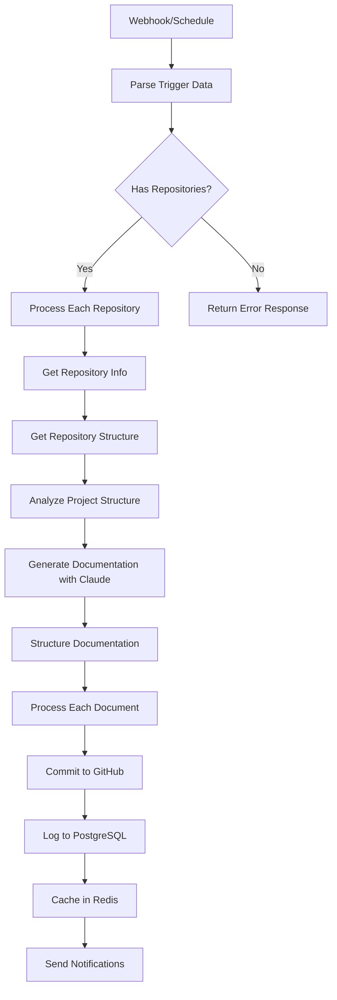

# Automated Project Documentation Generator

## Overview

This n8n workflow automatically generates and maintains comprehensive documentation for software projects across multiple repositories. It's designed to work with modern development stacks including Lovable, GitHub, Supabase, Claude.ai, Cursor, and local Docker environments.

## Features

### 🚀 Automated Documentation Generation
- **Multi-repository support**: Monitor and document multiple repos simultaneously
- **Tech stack detection**: Automatically identifies technologies in use (Node.js, Python, Docker, Supabase, etc.)
- **Comprehensive docs**: Generates README, Architecture, API, Deployment, and Contributing guides
- **AI-powered**: Uses Claude AI for intelligent, context-aware documentation

### 🔄 Continuous Updates
- **Webhook triggers**: Real-time updates when code changes
- **Scheduled scans**: Hourly checks for project changes
- **Version tracking**: Maintains documentation history and versioning

### 🔗 Integrations
- **GitHub**: Repository analysis and documentation commits
- **Claude AI**: Intelligent content generation
- **PostgreSQL**: Activity logging and audit trails
- **Redis**: Caching and performance optimization
- **Slack**: Team notifications

## Architecture

### Workflow Triggers
1. **Webhook Trigger** (`/project-docs-webhook`)
   - Manual project documentation requests
   - GitHub webhook integrations
   - CI/CD pipeline integration

2. **Schedule Trigger** (Hourly)
   - Automatic project scanning
   - Continuous documentation updates
   - Background maintenance

### Processing Pipeline



### Key Components

#### 1. Repository Analysis
- Fetches repository metadata and file structure
- Detects technology stack automatically
- Identifies project patterns and conventions

#### 2. AI Documentation Generation
- Uses Claude AI with specialized prompts
- Generates multiple document types
- Maintains consistent formatting and structure

#### 3. Storage and Distribution
- Commits documentation directly to repositories
- Logs all activities to PostgreSQL
- Caches status in Redis for performance
- Sends team notifications via Slack

## Setup Instructions

### Prerequisites
- n8n instance with the following nodes available:
  - `n8n-nodes-base.webhook`
  - `n8n-nodes-base.schedule`
  - `n8n-nodes-base.github`
  - `n8n-nodes-base.anthropic`
  - `n8n-nodes-base.postgres`
  - `n8n-nodes-base.redis`
  - `n8n-nodes-base.httpRequest`

### Required Credentials

#### 1. GitHub OAuth2
```json
{
  "clientId": "your_github_app_client_id",
  "clientSecret": "your_github_app_client_secret",
  "scope": "repo,read:user"
}
```

#### 2. Anthropic (Claude AI)
```json
{
  "apiKey": "your_anthropic_api_key"
}
```

#### 3. PostgreSQL Connection
```json
{
  "host": "localhost",
  "port": 5432,
  "database": "project_docs",
  "username": "your_db_user",
  "password": "your_db_password"
}
```

#### 4. Redis Connection
```json
{
  "host": "localhost",
  "port": 6379,
  "password": "your_redis_password"
}
```

### Database Setup

Create the PostgreSQL logging table:

```sql
CREATE TABLE project_documentation_log (
    id SERIAL PRIMARY KEY,
    project_name VARCHAR(255) NOT NULL,
    repository_name VARCHAR(255) NOT NULL,
    document_type VARCHAR(100) NOT NULL,
    generated_at TIMESTAMP NOT NULL,
    tech_stack JSONB,
    status VARCHAR(50) NOT NULL,
    created_at TIMESTAMP DEFAULT CURRENT_TIMESTAMP
);

CREATE INDEX idx_project_docs_project_name ON project_documentation_log(project_name);
CREATE INDEX idx_project_docs_generated_at ON project_documentation_log(generated_at);
```

### Environment Configuration

Set the following workflow parameters:
- `slackWebhookUrl`: Your Slack webhook URL for notifications

## Usage

### Manual Trigger via Webhook

Send a POST request to your n8n webhook URL:

```bash
curl -X POST https://your-n8n-instance.com/webhook/project-docs-webhook \
  -H "Content-Type: application/json" \
  -d '{
    "projectId": "my-awesome-project",
    "repositories": [
      {
        "name": "frontend-repo",
        "owner": "your-github-username",
        "branch": "main"
      },
      {
        "name": "backend-repo", 
        "owner": "your-github-username",
        "branch": "main"
      }
    ],
    "updateType": "manual"
  }'
```

### GitHub Integration

Add a webhook to your GitHub repository:
- **Payload URL**: `https://your-n8n-instance.com/webhook/project-docs-webhook`
- **Content type**: `application/json`
- **Events**: Push, Pull request

### Scheduled Execution

The workflow automatically runs every hour to check for updates. Modify the schedule trigger interval as needed.

## Generated Documentation

The workflow creates the following documents in each repository's `docs/` folder:

### 📖 README.md
- Project overview and description
- Quick start guide
- Installation instructions
- Basic usage examples

### 🏗️ ARCHITECTURE.md
- System architecture overview
- Component relationships
- Data flow diagrams
- Technology decisions

### 🔌 API.md
- API endpoint documentation
- Request/response examples
- Authentication details
- Error handling

### 🚀 DEPLOYMENT.md
- Deployment procedures
- Environment configuration
- Infrastructure requirements
- Monitoring and maintenance

### 🤝 CONTRIBUTING.md
- Development workflow
- Code standards
- Testing procedures
- Pull request guidelines

## Monitoring and Maintenance

### Logs and Analytics
- All documentation generation activities are logged to PostgreSQL
- Redis caches recent project status for quick lookups
- Slack notifications keep teams informed of updates

### Performance Optimization
- Repository processing is batched to handle multiple repos efficiently
- Redis caching reduces redundant API calls
- Document generation is limited to prevent API rate limits

### Error Handling
- Graceful handling of missing repositories
- Retry logic for failed API calls
- Detailed error logging for troubleshooting

## Customization

### Tech Stack Detection
Modify the `Analyze Project Structure` function to add support for additional technologies:

```javascript
// Add custom tech stack detection
if (files.includes('your-config-file')) {
  techStack.tools.push('Your Technology');
}
```

### Documentation Templates
Customize the Claude AI prompt in the `Generate Documentation with Claude` node to match your organization's documentation standards.

### Notification Channels
Add additional notification channels by creating new nodes after the `Prepare Notification` step.

## Troubleshooting

### Common Issues

#### 1. GitHub API Rate Limits
- Implement exponential backoff in retry logic
- Use GitHub App authentication for higher limits
- Cache repository data in Redis

#### 2. Claude AI Token Limits
- Break large repositories into smaller chunks
- Implement content summarization for large codebases
- Use streaming responses for better performance

#### 3. Database Connection Issues
- Verify PostgreSQL connection credentials
- Check network connectivity
- Implement connection pooling

### Debug Mode
Enable debug mode by adding console.log statements in function nodes and checking n8n execution logs.

## Contributing

This workflow is part of the n8n knowledge base. Improvements and bug fixes should be:
1. Tested in a development environment
2. Documented in the changelog
3. Committed with conventional commit messages
4. Tagged appropriately

## License

This workflow is provided as-is for educational and development purposes. Ensure compliance with all third-party service terms of use.