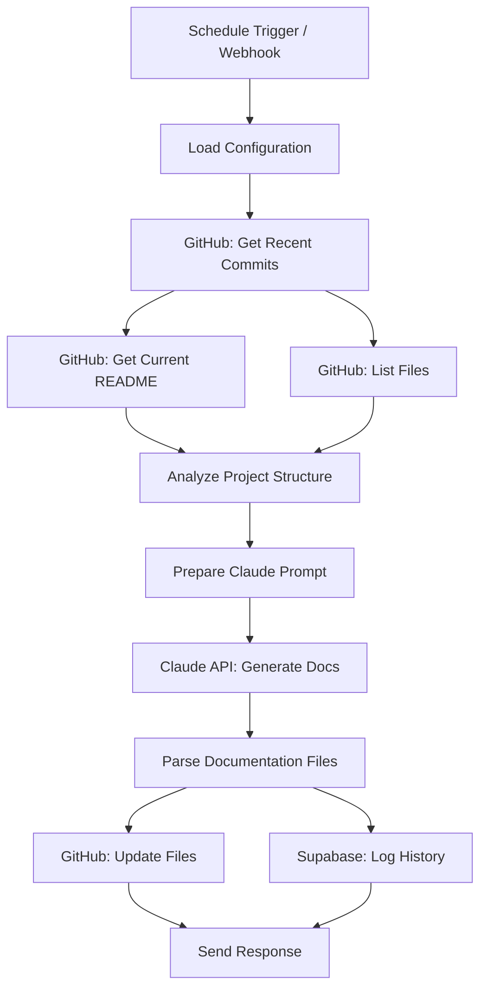

# Project Documentation Automation Workflow

## Overview
This n8n workflow automatically generates and maintains project documentation for single or multi-repository projects. It integrates with GitHub, Claude AI, and Supabase to provide continuous, AI-powered documentation updates.

## Features

### 🔄 Dual Trigger System
- **Scheduled**: Runs every 6 hours to check for updates
- **Webhook**: Triggered on-demand via GitHub webhooks or manual API calls

### 📊 Comprehensive Analysis
- Fetches recent commits and repository structure
- Analyzes file types and directory organization
- Tracks recent development activity
- Compares with existing documentation

### 🤖 AI-Powered Generation
- Uses Claude 3.5 Sonnet for intelligent documentation
- Generates:
  - **README.md**: Project overview, setup, tech stack
  - **ARCHITECTURE.md**: System design and component relationships
  - **CHANGELOG.md**: Recent updates and changes
- Maintains consistency with project's tech stack

### 💾 Multi-Storage Strategy
- **GitHub**: Commits documentation directly to repository
- **Supabase**: Logs documentation history for tracking and rollback

## Architecture



## Setup Instructions

### 1. Prerequisites
- n8n instance (local or cloud)
- GitHub account with repository access
- Claude API key
- Supabase project (optional, for history tracking)

### 2. Environment Variables
Configure these in your n8n instance:

```bash
# Required
CLAUDE_API_KEY=sk-ant-api...
GITHUB_TOKEN=ghp_...

# Optional (for Supabase logging)
SUPABASE_URL=https://your-project.supabase.co
SUPABASE_ANON_KEY=eyJ...
```

### 3. GitHub Credentials
1. In n8n, go to **Credentials** → **Create New**
2. Select **GitHub API**
3. Choose **Access Token** authentication
4. Enter your GitHub Personal Access Token with `repo` scope
5. Name it `GitHub account` (or update the workflow credential references)

### 4. Repository Configuration

#### Option A: Via Webhook Payload
Send POST request to the webhook URL with:
```json
{
  "repositories": [
    {
      "owner": "your-github-username",
      "repo": "repository-name",
      "branch": "main",
      "docPath": "docs/"
    }
  ]
}
```

#### Option B: Modify Workflow Default
Edit the "Merge Triggers" node and update the default repository configuration:
```javascript
{
  "owner": "your-org",
  "repo": "your-repo",
  "branch": "main",
  "docPath": "docs/"
}
```

### 5. Supabase Setup (Optional)
If using Supabase for history tracking, create this table:

```sql
CREATE TABLE documentation_history (
  id UUID DEFAULT gen_random_uuid() PRIMARY KEY,
  repository TEXT NOT NULL,
  file TEXT NOT NULL,
  content TEXT NOT NULL,
  updated_at TIMESTAMPTZ NOT NULL,
  trigger_source TEXT,
  created_at TIMESTAMPTZ DEFAULT NOW()
);

CREATE INDEX idx_doc_history_repo ON documentation_history(repository);
CREATE INDEX idx_doc_history_file ON documentation_history(file);
```

### 6. Import Workflow
1. Open n8n
2. Go to **Workflows** → **Import from File**
3. Select `project-documentation-automation.json`
4. Activate the workflow

### 7. Configure GitHub Webhook (Optional)
For automatic triggering on repository changes:

1. Copy the webhook URL from the "GitHub Webhook" node
2. In GitHub repository: **Settings** → **Webhooks** → **Add webhook**
3. Paste URL
4. Select events: `push`, `pull_request`
5. Save

## Usage

### Manual Trigger
Execute the workflow manually in n8n to generate documentation immediately.

### Webhook Trigger
```bash
curl -X POST https://your-n8n.com/webhook/doc-update \
  -H "Content-Type: application/json" \
  -d '{
    "repositories": [
      {
        "owner": "your-username",
        "repo": "my-project",
        "branch": "main",
        "docPath": ""
      }
    ]
  }'
```

### Scheduled Execution
Runs automatically every 6 hours (configurable in Schedule Trigger node).

## Multi-Repository Support

To document multiple repositories in one execution:

```json
{
  "repositories": [
    {
      "owner": "company",
      "repo": "frontend",
      "branch": "main",
      "docPath": ""
    },
    {
      "owner": "company",
      "repo": "backend",
      "branch": "main",
      "docPath": "docs/"
    },
    {
      "owner": "company",
      "repo": "mobile",
      "branch": "develop",
      "docPath": ""
    }
  ]
}
```

**Note**: Current version processes first repository. To handle multiple repos, add a **Split In Batches** node after "Load Configuration" or duplicate the workflow.

## Customization

### Modify Documentation Types
Edit the prompt in "Prepare Claude Prompt" node to change:
- Documentation structure
- Sections included
- Writing style
- Additional files to generate

### Adjust Analysis Depth
In "Analyze Project Structure" node, modify:
- Number of commits analyzed (default: 10)
- File type tracking
- Directory depth
- Additional metadata

### Change Schedule
In "Schedule Trigger" node:
- Default: Every 6 hours
- Options: Hourly, daily, weekly, custom cron

### Add Notifications
Add nodes after "Respond to Webhook":
- **Slack**: Send documentation update notifications
- **Discord**: Team alerts
- **Email**: Stakeholder updates

## Tech Stack Integration

This workflow is optimized for projects using:
- **Frontend**: Lovable, React, Next.js
- **Backend**: Supabase, Node.js, Python
- **AI Tools**: Claude.ai, Cursor AI
- **Infrastructure**: Docker, n8n, PostgreSQL, Redis, Qdrant
- **Version Control**: GitHub

Claude's prompt includes context about this tech stack to generate relevant documentation.

## Troubleshooting

### Issue: "Authentication failed" on GitHub nodes
- Verify GitHub credentials are properly configured
- Check token has `repo` scope
- Ensure repository owner/name are correct

### Issue: Claude API returns error
- Verify `CLAUDE_API_KEY` is set correctly
- Check API quota/limits
- Review prompt length (max 4000 tokens output)

### Issue: Documentation not committing to GitHub
- Check file path in repository exists
- Verify branch name is correct
- Ensure GitHub token has write permissions

### Issue: Supabase logging fails
- Verify `SUPABASE_URL` and `SUPABASE_ANON_KEY`
- Check table exists and RLS policies allow inserts
- Review Supabase logs for errors

## Extending the Workflow

### Add Code Analysis
Insert after "List Repository Files":
- **GitHub** node: Fetch specific source files
- **Code** node: Parse imports, dependencies
- Include in Claude prompt for deeper insights

### Version Control for Documentation
Add before "Update GitHub Documentation":
- **GitHub** node: Create documentation branch
- **GitHub** node: Create pull request
- Enables review before merging doc changes

### Multi-Language Support
Add after "Parse Documentation Files":
- **Code** node: Translate documentation
- **HTTP Request**: Use DeepL or Google Translate API
- Generate docs in multiple languages

### Analytics Dashboard
Add after "Log to Supabase":
- **Supabase** node: Aggregate documentation metrics
- **Webhook** node: Send to analytics platform
- Track documentation coverage, update frequency

## Performance Notes

- **Execution Time**: ~30-60 seconds per repository
- **API Costs**: ~$0.01-0.05 per run (Claude API)
- **GitHub Rate Limits**: 5000 requests/hour (authenticated)
- **Recommended Frequency**: 4-6 hours for active projects

## Security Considerations

1. **API Keys**: Store in n8n environment variables, never in workflow
2. **Webhook Authentication**: Add basic auth or secret validation
3. **Supabase RLS**: Enable Row Level Security on documentation_history table
4. **Repository Access**: Use GitHub tokens with minimal required scopes
5. **Sensitive Data**: Exclude .env files, secrets from analysis

## License & Credits

This workflow template is part of the n8n Workflows Knowledge Base.

**Created**: 2025-10-22  
**Last Updated**: 2025-10-22  
**Version**: 1.0.0

## Support

For issues or questions:
1. Check troubleshooting section above
2. Review n8n community forums
3. Consult Claude API documentation
4. GitHub API reference: https://docs.github.com/rest
